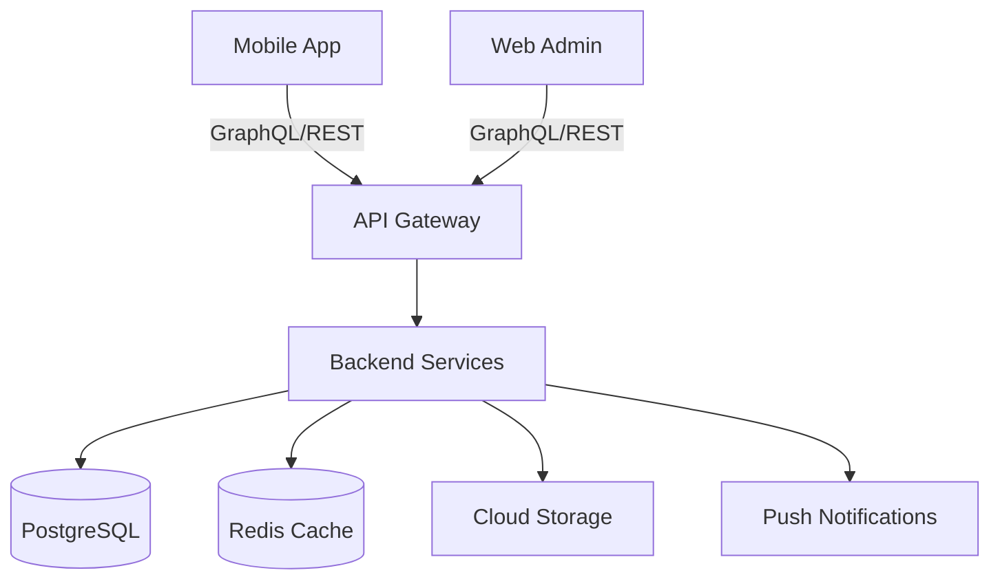

# ColeApp - Arquitectura del Sistema

## Visión General
Sistema de comunicación multitenant entre colegios y familias con campos dinámicos y reglas de negocio personalizables por institución.

## Stack Tecnológico

### Frontend Mobile (iOS)
- **Framework:** React Native 0.73+
- **Navigation:** React Navigation v6
- **State Management:** Redux Toolkit + RTK Query
- **UI Components:** React Native Elements + Custom Design System
- **Forms:** React Hook Form
- **Notifications:** Firebase Cloud Messaging
- **Storage:** AsyncStorage + MMKV for sensitive data

### Web Admin Panel
- **Framework:** Next.js 14 (App Router)
- **UI Library:** shadcn/ui + Tailwind CSS
- **State Management:** Zustand + TanStack Query
- **Forms:** React Hook Form + Zod
- **Tables:** TanStack Table
- **Charts:** Recharts

### Backend
- **Runtime:** Node.js 20 LTS
- **Framework:** NestJS
- **API:** GraphQL (Apollo Server) + REST endpoints
- **Authentication:** Firebase Auth + Custom JWT
- **Database ORM:** Prisma
- **Validation:** class-validator + class-transformer
- **Queue System:** Bull (Redis)
- **File Storage:** Google Cloud Storage

### Database
- **Primary:** PostgreSQL 15 (Cloud SQL)
- **Cache:** Redis (Memorystore)
- **Search:** Elasticsearch (optional)
- **Schema Management:** Prisma Migrations

### Infrastructure (Google Cloud)
- **Compute:** Cloud Run (containerized services)
- **Database:** Cloud SQL (PostgreSQL)
- **Cache:** Memorystore (Redis)
- **Storage:** Cloud Storage (archivos, imágenes)
- **CDN:** Cloud CDN
- **Monitoring:** Cloud Monitoring + Logging
- **CI/CD:** Cloud Build + GitHub Actions
- **Secrets:** Secret Manager

## Arquitectura Multitenant

### Estrategia: Schema-per-tenant
- Cada colegio tiene su propio schema en PostgreSQL
- Schema compartido para datos globales (usuarios, configuraciones)
- Aislamiento completo de datos entre tenants

### Campos Dinámicos
```typescript
interface DynamicField {
  id: string;
  tenantId: string;
  entityType: 'student' | 'parent' | 'teacher' | 'event';
  fieldName: string;
  fieldType: 'text' | 'number' | 'date' | 'select' | 'file';
  validations: ValidationRule[];
  metadata: Record<string, any>;
}
```

## Módulos Principales

### 1. Autenticación y Autorización
- Login con email/password
- SSO opcional (Google, Microsoft)
- Roles: SuperAdmin, SchoolAdmin, Teacher, Parent
- Permisos granulares por módulo

### 2. Comunicación
- **Novedades:** Publicaciones del colegio
- **Mensajes:** Chat bidireccional
- **Eventos:** Calendario escolar
- **Cambios de Salida:** Autorización digital
- **Boletines:** Calificaciones y reportes

### 3. Gestión Administrativa
- Configuración de campos personalizados
- Reglas de negocio (workflows)
- Gestión de usuarios y roles
- Reportes y analytics

## Flujo de Datos



## Seguridad
- Encriptación en tránsito (TLS 1.3)
- Encriptación en reposo (Cloud KMS)
- Rate limiting por tenant
- OWASP compliance
- GDPR/COPPA compliance
- Audit logs

## Escalabilidad
- Horizontal scaling con Cloud Run
- Database connection pooling
- Redis caching strategy
- CDN para assets estáticos
- Queue system para tareas pesadas

## Monitoreo
- APM con Cloud Trace
- Error tracking con Sentry
- Métricas custom con Cloud Monitoring
- Alertas automatizadas
- Dashboards por tenant